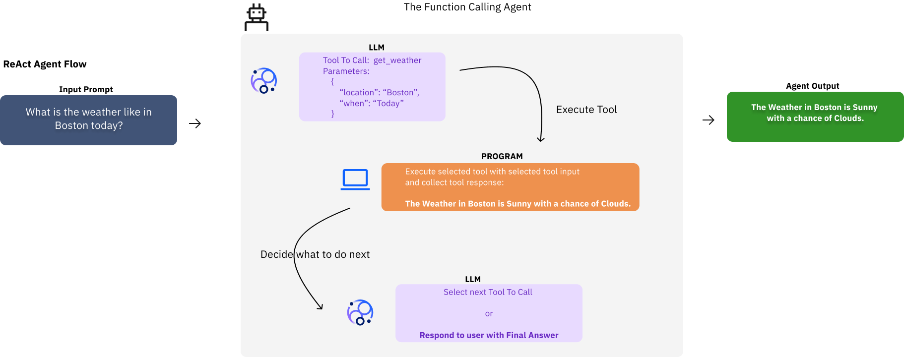

# :rocket: Building Agents with Granite: From Prototype to Production 

In this blog, we introduce a decision-framework to help agent developers build simple but performant AI Agents. We cover insights on:
1. [Building your Agent](#1-hammer-building-your-agent)
2. [Testing your Agent](#2-microscope-testing-your-agent)
3. [Enhancing your Agent](#3-chart_with_upwards_trend-enhancing-your-agent)

### :seedling: Motivation 

Through various engagements, we have noted that development teams are building agents with unique architectures, which are not necessarily optimal. In this guide, we offer up a paradigm of simple design followed by a policy of testing your agent before introducing enhancements to the agent architecture to meet use case or performance requirements. 

### :white_check_mark: Prerequisites

In this guide, we assume some knowledge of the following topics (if you need recaps on these, the following links will cover the basics needed for this content):

- Access to a LLM. You can provision your own access to watsonx.ai by following this guide: [Using IBM Granite 3.3 on watsonx.ai.](github.com/ibm-granite-community/granite-kitchen/pull/58)

- Basic understanding of what are AI Agents. For a quick refresher, check out the post here: [What are AI agents?](https://www.ibm.com/think/topics/ai-agents#7281535)

- Basic understanding of Retreival Augmented Generation (RAG). For a recap look here: [What is retrieval-augmented generation?](https://research.ibm.com/blog/retrieval-augmented-generation-RAG)

## 1. :hammer: Building Your Agent

Agent developers can build agents with many different architectures. But we believe that any project involving the development of an agent should always start from the same place: that is, validating whether or not a simple **Function Calling Agent** is able to meet the requirements of the desired use cases. 

### Function Calling Agent

All agent architectures likely call some functions or tools. So what does it mean to be a simple Function Calling Agent Architecture?

**Definition**: **Function Calling (FC)** is a capability offered out of the box by most chat tuned or instruction tuned models. In this architecture, each model can select from a set of functions or tools to aide in information collection, before responding to the end user query. 

In its most basic incarnation, an FC Agent is nothing more than:
- An LLM informed about a toolkit or function set. 
- A program able to execute the function or tools from the toolkit. 

The flow for an FC Agent is:
1. A user sends a query to the FC Agent.
2. The FC Agent routes the query to the LLM.
3. The LLM responds with either: 
    1. a final answer; then the answer is sent back to the user. Done!
    2. or a tool to use; then the program executes the tool.
4. Upon completion, the result of the tool execution is sent back to the LLM with the original query.
5. Repeat step 3 until a final answer is received. 


*FC Agent Flow Example*

:exclamation: A common misconception is that the LLM underlying the Agent is able to execute tools, when in fact the LLM is only selecting a tool for execution based on the query. The tool execution is performed by the program supplementing the LLM invocations. 

### Example

We give below an example of an LLM responding with a tool call with [watsonx.ai chat API](https://dataplatform.cloud.ibm.com/docs/content/wsj/analyze-data/fm-api-chat-tools.html?context=wx).


**Chat API Request**:
```bash
curl -X 'POST' \
  "${LLM_PROVIDER_URL}/v1/chat/completions" \
  -H 'accept: application/json' \
  -H 'Content-Type: application/json' \
  -d '{
  "messages": [
    {
      "role": "user",
      "content": "What is the weather like in Boston today?"
    }
  ],
  "tools": [
    {
      "type": "function",
      "function": {
        "name": "get_current_weather",
        "description": "Get the current weather in a given location",
        "parameters": {
          "type": "object",
          "properties": {
            "location": {
              "type": "string",
              "description": "The city and state, e.g. San Francisco, CA"
            },
            "unit": {
              "type": "string",
              "enum": [
                "celsius",
                "fahrenheit"
              ]
            }
          },
          "required": [
            "location"
          ]
        }
      }
    }
  ],
  "model": "ibm-granite/granite-3-3-8b-instruct"
}'
```

**Response**: 

```json
{
  "id": "chatcmpl-d19a2a76b2e04a82ac89af71343b54f6",
  "object": "chat.completion",
  "created": 1756821450,
  "model": "ibm-granite/granite-3-3-8b-instruct",
  "choices": [
    {
      "index": 0,
      "message": {
        "role": "assistant",
        "content": null,
        "tool_calls": [
          {
            "id": "chatcmpl-tool-0d0a5d5d79594690a1a1f36cc96b4c66",
            "type": "function",
            "function": {
              "name": "get_current_weather",
              "arguments": "{\"location\": \"Boston\"}"
            }
          }
        ]
      },
      "logprobs": null,
      "finish_reason": "tool_calls",
      "stop_reason": null
    }
  ],
  "usage": {
    "prompt_tokens": 422,
    "total_tokens": 447,
    "completion_tokens": 25,
    "prompt_tokens_details": null
  },
  "prompt_logprobs": null
}
```

Note the `tool_calls` in the response object identifying the tool the model has selected to be invoked based on the query. 

## 2. :microscope: Testing Your Agent

Before we increase the complexity of our FC Agent architecture, we should validate the need for additions into the architecture. This is done by defining a **test set**, capturing the desired use cases for this agent and running a set of evaluations against the agent. 

To define a test set, the following pieces of information are required:

- Input test query.
- Agent setup: required connections, available tools, etc. This can be static and shared by all test cases.
- Expected tool call trajectories, with tool call ordering and expected parameters.
- Expected agent final responses. 

In most cases this information is enough to enable the automation of agent evaluation. Agents can be instrumented with logging or observability frameworks to capture actual agent execution to compare against the collected test datasets. 

The evaluation typically follows two sections:
1. [Trajectory evaluation](#trajectory-evaluation)
2. [Agent response evaluation](#agent-response-evaluation)

### Trajectory evaluation

**Trajectory evaluation** answers the following: did the agent execute the right tools with the right parameters, as documented in the expected tool call trajectories? This is commonly done as a programmatic check testing for containment or exact matches in different settings. 

- The most common policy for evaluation is an **Abstract Syntax Tree policy**. You can read more about that in this blog: https://gorilla.cs.berkeley.edu/blogs/8_berkeley_function_calling_leaderboard.html#metrics.

- But the policy for evaluations can vary by the setup of your agent. _For example, suppose your toolset contains tools which can delete or write data. If those tools are incorrectly called, it can be catastrophic for a system._ In scenarios such as this, an exact match policy might be more suitable. 

- In some cases, trajectory evaluation may also need to be done in a non-deterministic way, with an LLM-as-a-Judge evaluator. This is useful when parameters change depending on when the test pipeline was run and when the test set was defined. _For example, suppose your toolset contains tools which take timestamps as parameters._

### Agent response evaluation

**Agent response evaluation** answers the following: did the agent respond with the Natural Language (NL) response that was expected? In this case the evaluation is typically done using a LLM-as-a-Judge to enable for NL comparisons between expected and real responses. Other strategies or metrics which can be used include Semantic Similarity, BLEU, ROUGE scores. 

### Other evaluations

Depending on your requirements you may also be interested in evaluating the agent in additional areas such as: token usage/cost of agent, inference time/time-to-first-token (TTFT), number of model invocations, etc. These can offer a more rounded set of information when rolling out your agent to production. 

There are various emergent agent evaluation frameworks that can be used to assist in this section. _For example, [Langfuse](https://langfuse.com) provides a simple way to instrument your agent along with a nicely packaged UI for observing and stepping through your Agent’s internal processing._

## 3. :chart_with_upwards_trend: Enhancing your Agent

After evaluating your agent for use case-specific tasks and goals, there are various ways to improve your agent. The first should always be a review of your toolset. Can you identify:

- Tools which have overlapping functionality.
- Tools which the agent commonly misuses.

Following this review, Tool and Parameter descriptions should be updated to make easy gains for the agent without any increasing its complexity. Similarly, if your FC Agent utilized a custom system prompt, now is the time to review it: add some generic hints to benefit from easy wins. The evaluation framework and the defined test set offers a means to quickly validate updates to the agent and quantify their effectiveness. 

In some case cases, the FC Agent architecture may still prove to be missing accuracy requirements. This can occur for a range of reasons. _For example, if you have a large number of tools in your tool set (50+), if your tools are particularly complex (large number of input parameters) or if the queries require a high number of reasoning steps._ In such setups we can adapt our agent and augment it with more LLM powered nodes and step closer to the requirements for the agent. In this section we cover a few of those architectures and when you may consider using them. 


|Architecture|Description|Pros|Cons|When to use|
| -------- | ------- |-------- | ------- | -------- |
| **Plan-and-Solve Agents**| Plan-and-Solve Agents consist of a planner node and function calling node. The planner node is responsible for considering the query, coming up with reasoning and generating a complete plan for execution, selecting the tools to use and their ordering. <br> <br> The output of the planner node is passed to the FC Node which loads up the tool calls, assisted by the LLM to set the tool call parameters. <br> <br> Once the FC node has executed the plan, the agent may or may not invoke the planner node again to determine if some additional steps are required based on the tool results.| Plan can be extracted and observed. <br> <br> Planning evokes thinking/reasoning behaviours, often leading to higher accuracy. <br> <br> The FC node does not have to do the complex task of decision-making, it only has to load up the prescribed tool-call objects. <br> <br> Supporting hints/examples of tools used for queries can aide in agent accuracy. | Additional model invocations required for planning. |This approach is useful when you have tools or an agent setup that requires custom reasoning instructions, such as hints. This approach is also useful when you want to define interdependencies between tools. <br> <br> Also this setting can empower use cases where there are longer reasoning traces or more steps required then simpler agents with target use cases only needing a few tools to be executed per query. <br> <br> In production settings, this approach can offer a more simplified human-in-the-loop pattern by allowing the user to validate generated plans before execution.| 
|**Route-and-Solve Agents**| Route-and-Solve Agents consist of a router and multiple function calling nodes. Each of the function calling nodes has, in its toolkit, a subset of the complete list of tools. This enables a sort of semantic grouping of the tools into different categories, that the router can select from based on the end user query. <br> <br> This approach can be thought of as a Router which routes to multiple function calling sub-agents.| Subagent architectures enable conceptual segmentation and reduce likelihood of incorrect tool selection. <br> <br> Easily extendible in a modular way with new subagents as required. | Subagent routing and rerouting to supervisor can impose complicated logic with unique edge cases. |This approach is effective when there is a natural clustering of tools which can be applied to the complete toolkit. <br> <br> _For example, if your agent has tools that interact with the Internet, a Database and Email, you may define a sub-agent for each of these._ <br> <br> This approach also improves performance when there may be a large set of tools available. Since each sub-agent only chooses from a subset of the tools, it is less likely to select an incorrect tool if the Router has effectively done its job.|
|**ToolRAG Agents**| ToolRAG Agents operate by first doing RAG on the set of available tools based on the query and only show a susbet of the toolset to the model to select from for a given query. This pre-filtering approach reduces the likelihood of the model choosing the wrong tools as it is already being shown a smaller set of relevant tools to pick from. | Reduced likelihood of wrong tool selection. <br> <br> Reduce number of input tokens used for model invocation. <br> <br> Esay way to extend with new tools without incurring concerns of context windows or agent accuracy regression. | Tool prefiltering may not raise up the relevant tool for model to select from. | This approach is effective when you have a large set of tools and not all are relevant for any single query. <br> <br> This dynamic filtering is different to the Route and Solve Agents which is a static grouping defined by the agent dev at build time. This approach instead dynamically filters at runtime based on the incoming query.|
|**ReACT/Reasoning Agents**| ReAct and Reasoning Agents are similar to function calling agents but with additional reasoning. They justify which tool to use with some prerequisite reasoning to help correctly identify the tool to use and run. <br> <br> Each tool selection is followed by another iteration to see if the agent reasons to select another tool or is ready to answer. | Reasoning augmented tool calling can improve accuracy on non-reasoning approaches. <br> <br> Iterative tool loading can improve on agent accuracy for longer trajectory based problems. | Reasoning requires additional token outputs which can contribute to inference time and dollar token costs. <br> <br> ReAct and reasoning patterns may require custom response parsing which can require model specific code. | This approach is effective and extends upon the simple function calling approach we introduced before, but requires the model to have been fine-tuned on reasoning and tool calling. <br> <br> This approach is suitable for scenarios that have a small to medium list of tools and the use cases for that agent are targeted to a domain. <br> <br> Accompanying this approach with ToolRAG can enable the extension of this agent to work with more tools and more generic utterances. | 

Experiments with these agents can be facilitated again by the [Test Your Agent](#2-microscope-testing-your-agent) section. Remember, performance measurements on a well defined test set can ultimately empower decision-making.

## Conclusion

In this blog we have introduced a guide for developing agents from prototype to production. A key characterisitc of product development is always a well defined testing strategy. Teams which use Test Driven Development (TDD)  can benefit from improved code simplicity and robustness. In this blog we introduce the equivalent for the development of agentic or LLM-powered applications, and present how to use test-driven ideology to motivate enhancements in your agent architectures. 

We believe that agents do not have to be complicated black-boxes for operation. Designing agents with observability and explainability in mind is the basis for a strong agent to be taken to market or deployed in real world scenarios. 